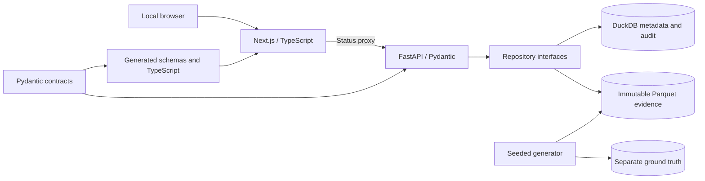
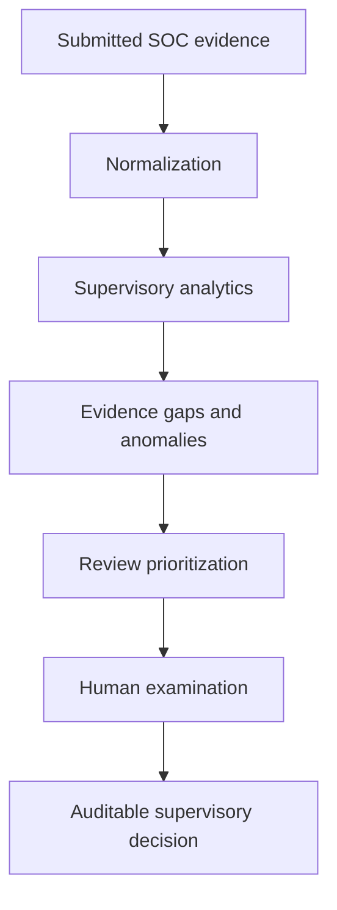

# SAT-SA

**VISTA repository · Verified Phase 1 foundation**

[Quick start](#quick-start) · [Setup](#native-setup-windows-powershell) · [Architecture](#architecture-and-repository-map) · [Data](#synthetic-dataset) · [Qwen](#optional-local-qwen) · [Tests](#tests-and-verification) · [Troubleshooting](#troubleshooting) · [Documentation](#documentation-map)

<details>
<summary><strong>Choose your starting point</strong></summary>

- Run the synthetic demonstration: follow the Docker quick start.
- Develop locally: follow the Python/Node setup below.
- Examine evidence: read the data dictionary and sample Parquet files.
- Audit the implementation: read the Phase 1 verification report.
- Deploy without Internet: prepare images first, then follow the air-gap instructions.

This README uses GitHub-native collapsible guides, navigation links and Mermaid diagrams. It does not require executable JavaScript or a documentation service.

</details>

## Quick start

Prerequisites: Git, Docker with Compose, and access to dependency registries for the initial build, or prepared application images.

```powershell
git clone https://github.com/nischala755/VISTA.git
cd VISTA
docker compose up --build --wait
```

Open **http://127.0.0.1:3001**. Expect **Backend connected**, storage ready, and **1** registered dataset. First startup generates synthetic evidence; subsequent startups verify and reuse it.

| Service | Docker | Native |
| --- | --- | --- |
| Application | http://127.0.0.1:3001 | http://127.0.0.1:3000 |
| Backend health | http://127.0.0.1:8001/api/v1/health | http://127.0.0.1:8000/api/v1/health |
| OpenAPI schema | http://127.0.0.1:8001/openapi.json | http://127.0.0.1:8000/openapi.json |
| Frontend status proxy | http://127.0.0.1:3001/api/status | http://127.0.0.1:3000/api/status |

<details>
<summary><strong>Container operations and persistence</strong></summary>

```powershell
docker compose ps
docker compose logs --tail 100 api web
docker compose stop
docker compose start --wait
```

`docker compose down` retains the named data volume. Do not add `--volumes` when preserving evidence and audit history. `sat-sa_sat-sa-data` is mounted at `/var/lib/sat-sa` inside the API container. Bootstrap finishes before the API starts; one API worker owns metadata writes.

</details>

<details>
<summary><strong>View the verified application and failure state</strong></summary>


These screenshots record the verification session; they are not live status indicators. The second was captured with the backend actually stopped.

</details>

## Delivery status

| Capability | Status |
| --- | --- |
| Application shell and actual storage/backend health | Implemented |
| Domain validation and reproducible generated contracts | Implemented |
| Immutable Parquet evidence and DuckDB metadata/audit | Implemented |
| Seeded multi-entity synthetic dataset | Implemented |
| Separate ground truth | Implemented; excluded from evidence table selection |
| Docker and isolated core runtime verification | Verified with networking limits documented below |
| Ingestion UI, analytics, evidence-gap detection and ranking | Future phases |
| Dashboards, human review workflow and production authentication | Future phases |
| Optional local Qwen evidence summaries | Proposed; design approval pending |

Supervisory Analytics Tool for SOC Assessment

SAT-SA is intended to help NCIIPC supervisors examine periodic submitted SOC evidence. The product chain is submitted evidence → normalization → supervisory analytics → evidence gaps/anomalies → review prioritization → human examination → auditable supervisory decision.

**Phase 1 only:** runnable application shell, live backend/storage status, canonical domain contracts, local DuckDB metadata/audit persistence, immutable Parquet evidence and a deterministic synthetic dataset. There is no ingestion wizard, analytical engine, dashboard, review ranking or decision workflow yet. No analytical results are fabricated.

## Requirements and architecture

Authority: [problem statement](docs/problem-statement.md), [approved architecture](docs/architecture.md), [AGENTS.md](AGENTS.md), then [Phase 1 plan](docs/superpowers/plans/2026-09-27-phase-1.md). AGENTS.md is currently empty and has been preserved.

Next.js/TypeScript serves the application shell and a same-origin status proxy. FastAPI/Pydantic owns the status API. Repository interfaces separate local DuckDB metadata from immutable Parquet evidence. Python analytics packages are boundaries for later implementation. One process owns metadata writes; stop the API before running a metadata-writing CLI.

## Native setup (Windows PowerShell)

Use Python 3.12 and Node.js 24. Dependency installation requires a prepared package cache or a network connection. Runtime uses only local services.

```powershell
python -m venv .venv
.venv\Scripts\python -m pip install -r requirements.lock
.venv\Scripts\python -m pip install -e . --no-deps
npm --prefix apps/web ci --no-audit --no-fund
.venv\Scripts\python scripts/export_contracts.py --check
```

Initialize a local demo volume before starting the API:

```powershell
.venv\Scripts\python -m sat_sa.synthetic.bootstrap
```

This generates evidence in `runtime/evidence/demo`, separate labels in `runtime/ground_truth/demo` and metadata in `runtime/metadata.duckdb`. It is idempotent: subsequent calls verify existing evidence and preserve registration/audit history. A changed seed, corrupt artifact or conflicting immutable registration fails explicitly. Do not run it concurrently with the API.

Terminal 1, from the repository root:

```powershell
.venv\Scripts\python -m uvicorn sat_sa_api.main:create_app --factory --host 127.0.0.1 --port 8000 --workers 1
```

Terminal 2:

```powershell
npm --prefix apps/web run dev
```

Open `http://127.0.0.1:3000`. The shell shows actual API connectivity and registered dataset count. Its retry action reports backend failures visibly. API health: `http://127.0.0.1:8000/api/v1/health`; OpenAPI JSON: `http://127.0.0.1:8000/openapi.json`. CDN-backed interactive documentation is disabled.

For a production frontend build:

Stop any running production frontend before rebuilding, particularly on Windows where the running standalone server holds its build directory open.

```powershell
npm --prefix apps/web run build
npm --prefix apps/web start
```

Linux/macOS use `.venv/bin/python` in place of `.venv\Scripts\python`; the other commands are equivalent.

## Synthetic dataset

Checked-in evidence: `data/sample/demo`; ground truth: `data/ground_truth/demo`. Seed `20260927` produces eight entities, two sectors/cohorts, twelve months in 2025, 192 assets, 6,816 alerts, 852 cases, 3,322 investigation events and 2,696 escalation records. All names and evidence are synthetic. Investigation text is represented by short synthetic actions and notes lengths, not sensitive raw notes.

Generate another copy into unused directories:

```powershell
.venv\Scripts\python scripts/generate_demo.py --seed 20260927 --output artifacts/replica/demo --labels-output artifacts/replica-labels/demo
```

Paths must not already exist. The dataset folder name is its logical version ID; use `demo` in both copies when comparing full manifest bytes. The same seed, version ID and pinned writer version produce equal logical records and artifact hashes. A different seed changes evidence. The generator never reads labels. Labels are not an allowed evidence repository table and have no API route.

To register a newly generated version in an inactive local database, append `--register runtime/metadata.duckdb`. Duplicate registration is an error, including identical duplicates; bootstrap provides explicit idempotence without overwriting a version.

## Tests and verification

```powershell
.venv\Scripts\python -m pytest -q
.venv\Scripts\python scripts/export_contracts.py --check
npm --prefix apps/web test
npm --prefix apps/web run typecheck
npm --prefix apps/web run build
```

With the API and web application running and the replica generated:

```powershell
.venv\Scripts\python scripts/verify_phase1.py --web-url http://127.0.0.1:3000
npm --prefix apps/web run test:e2e
```

Browser tests default to locally installed Microsoft Edge. For another prepared Playwright browser, set `PLAYWRIGHT_CHANNEL=chromium` and install its browser binary during dependency preparation, not at offline runtime. Set `SAT_SA_WEB_URL` to test a different application address.

The [verification report](docs/phase-1-verification.md) contains actual command results and acceptance gaps. No precision, recall or ranking effectiveness is claimed before analytics exist.

## Docker and air-gapped deployment

On a machine with Docker running and access to build dependencies:

```powershell
docker compose up --build --wait
```

Open `http://127.0.0.1:3001`; API health is on `http://127.0.0.1:8001/api/v1/health`. Ports differ from native development so both can be verified independently. A local bridge provides loopback-published ports, and the named `sat-sa_sat-sa-data` volume preserves evidence and metadata. Images generate the demo on first start; no runtime download is required. Normal Compose does not itself enforce outbound network blocking; the air-gapped host/network supplies that boundary.

Prepare and transfer images before disconnecting:

```powershell
docker compose build
docker image save -o sat-sa-phase1-images.tar sat-sa-api:phase1 sat-sa-web:phase1
```

On the air-gapped host, copy the image archive and `compose.yaml`, then:

```powershell
docker image load -i sat-sa-phase1-images.tar
docker compose up --pull never --no-build --wait
```

See [deployment details](docs/deployment.md) for storage, boundaries and verification. Building on an unprepared disconnected host is not supported.

`python scripts/verify_containers.py` verifies actual outage handling and persistence, then temporarily applies `compose.offline.yaml`. That override puts both services on an internal-only network, verifies denied external TCP access and successful internal frontend/assets/API requests, and restores normal localhost access. Docker Desktop does not publish host ports in the isolated mode. The script must run only against this project's synthetic demo; it stops/recreates its services and preserves the volume.

## Configuration and limits

`SAT_SA_STORAGE_ROOT` selects local storage; `SAT_SA_DEMO_SEED` selects the deterministic seed before initial generation. `SAT_SA_DEMO_MODE` must be true in Phase 1: non-demo mode fails closed because production authentication is not implemented. No login credentials are required for the local synthetic demonstration. Never use Phase 1 with real restricted SOC submissions or expose it beyond the controlled host.

`config/defaults.json` contains documented future analytical configuration. No configured threshold is executed in this phase. See [data dictionary](docs/data-dictionary.md), [methodology boundaries](docs/analytics-methodology.md) and [validation methodology](docs/validation-methodology.md).

The synthetic generator builds a bounded demonstration dataset in memory. This is not a tested million-record importer. The evidence reader applies entity filters and pagination in DuckDB; later ingestion needs streaming/chunking. Filesystem administrators can modify local files; hashes detect altered artifacts during verification/bootstrap but are not cryptographic signing or tamper-proof audit storage. Encryption at rest is a deployment-managed encrypted-volume responsibility.

## Architecture and repository map



The approved product flow below describes the intended system, not a claim that every stage is delivered:



```text
apps/api/sat_sa_api/          FastAPI factory and storage health
apps/web/                    Next.js shell, status proxy and tests
analytics/sat_sa/config/     Validated settings
analytics/sat_sa/repositories/ DuckDB/Parquet repository implementations
analytics/sat_sa/synthetic/  Seeded generator and bootstrap
analytics/sat_sa/...         Reserved analytics and ingestion boundaries
packages/analytics-contracts/ Canonical Pydantic domain models
packages/shared-types/      Generated TypeScript contracts
data/sample/demo/           Six evidence tables and immutable manifest
data/ground_truth/demo/      Separate synthetic scenario labels
data/schemas/               Generated JSON schemas
config/                     Future analytical configuration
docker/                     API/frontend Dockerfiles
scripts/                    Generation and verification commands
tests/                      Python regression tests
docs/                       Architecture, methods and verification
compose.yaml                Local deployment
compose.offline.yaml        Internal-network verification override
```

### Domain and evidence rules

| Contract | Responsibility |
| --- | --- |
| CSE | Entity, sector, cohort, criticality and assessment period |
| Asset | Entity-scoped inventory and monitoring expectation |
| Alert | Lifecycle and links to assets/cases/escalation evidence |
| Case | Investigation lifecycle, assignment and disposition |
| InvestigationEvent | Timestamped action and source provenance |
| EscalationRecord | Explicit escalation linked to an alert/case |
| DatasetVersion | Immutable hashes, counts and schema/generator versions |
| AnalyticsRun | Future execution provenance; no runs produced yet |
| SupervisorySignal | Future evidence-backed indicator; none fabricated |
| EvidenceReference | Dataset/entity/type/record identity and provenance |
| ReviewDecision | Future human decision contract; no generated decisions |
| AuditEvent | Persisted registration/action history |

Unknown fields, naive timestamps, reversed lifecycles and invalid negative counts fail validation. Missing optional evidence remains null. Entity-scoped references cannot be satisfied by an identically named record in another CSE. Missing escalation evidence is not proof that escalation never occurred.

## Runtime configuration reference

| Variable | Default | Purpose |
| --- | --- | --- |
| `SAT_SA_STORAGE_ROOT` | `runtime` | Local data root; Compose uses `/var/lib/sat-sa` |
| `SAT_SA_DEMO_MODE` | `true` | Non-demo mode fails closed |
| `SAT_SA_DEMO_SEED` | `20260927` | First-generation seed; cannot overwrite existing evidence |
| `SAT_SA_API_URL` | `http://127.0.0.1:8000` | Frontend's server-side API URL; Compose uses `http://api:8000` |
| `NEXT_TELEMETRY_DISABLED` | Set by launch scripts | Disables Next.js telemetry |
| `SAT_SA_CONFIG` | `config/defaults.json` | Future analytical configuration; inactive in this phase |
| `SAT_SA_WEB_URL` | Native local application | Browser-test target |
| `PLAYWRIGHT_CHANNEL` | `msedge` | Prepared browser for tests |

Set variables in the process's launching shell. The backend does not automatically load `.env`. Compose only passes variables explicitly referenced by its configuration. No API key is required; never put credentials in tracked files.

<details>
<summary><strong>Linux/macOS native setup</strong></summary>

```bash
python3.12 -m venv .venv
.venv/bin/python -m pip install -r requirements.lock
.venv/bin/python -m pip install -e . --no-deps
npm --prefix apps/web ci --no-audit --no-fund
.venv/bin/python scripts/export_contracts.py --check
.venv/bin/python -m sat_sa.synthetic.bootstrap
.venv/bin/python -m uvicorn sat_sa_api.main:create_app --factory --host 127.0.0.1 --port 8000 --workers 1
```

In another terminal at the repository root, run `npm --prefix apps/web run dev`. These are equivalent setup instructions; the recorded native verification used Windows. Linux runtime was tested in Docker, not every Linux/macOS host configuration.

</details>

## Optional local Qwen

**Status: proposed extension, not implemented or covered by Phase 1 verification.** The selected purpose is local evidence-summary drafting for human review. The [design](docs/local-qwen-design.md) describes a bounded command, source references, label exclusion, visible errors and no writes to signals or decisions. Application startup remains independent of AI.

No Mistral adapter, cloud fallback or API key is configured.

<details>
<summary><strong>Prepare the local model</strong></summary>

Install [Ollama](https://ollama.com/download). Model acquisition is a dependency-preparation step requiring connectivity unless transferred through an approved offline process.

```powershell
ollama --version
ollama list
# Only when the model is absent, during dependency preparation:
ollama pull qwen3.5:2b
```

The development host has Ollama `0.34.4` and `qwen3.5:2b`, approximately 2.7 GB on disk. Disk size is not a RAM/VRAM requirement or a performance guarantee.

For a dedicated local service:

```powershell
$env:OLLAMA_NO_CLOUD = '1'
$env:OLLAMA_HOST = '127.0.0.1:11434'
ollama serve
```

If the desktop service already owns the port, configure/restart that service instead of starting another. Model presence alone does not establish offline isolation. AI inference must be tested separately under blocked egress before claiming offline readiness.

References: [Ollama chat API](https://docs.ollama.com/api/chat) and [server/cloud configuration](https://docs.ollama.com/faq). The proposed adapter uses non-streamed generation, bounded context and no tools; these controls are not yet implemented in this repository.

</details>

## Recorded verification results

The [Phase 1 report](docs/phase-1-verification.md) records exact commands, versions, failures encountered and final results on **2026-09-27**. These are historical results, not live badges.

| Gate | Result |
| --- | --- |
| Python suite | 57 passed |
| Frontend unit suite | 5 passed |
| Browser suite | 2 passed |
| Type checking and production build | Passed |
| Contract freshness | 20 artifacts verified |
| Same-seed records and artifact hashes | Identical; Windows/Linux hash matched |
| Different seed | Different dataset |
| Duplicate registration / immutable version | Overwrite rejected |
| Process/application/container restart | Metadata and audit persisted |
| Actual backend outage | Visible failure and retry |
| Docker build and startup | Verified |
| Core isolated runtime | Verified with denied external TCP probes |
| Qwen inference / AI offline isolation | Not yet verified |

Regenerate contracts only after an intentional canonical model change:

```powershell
.venv\Scripts\python scripts/export_contracts.py
.venv\Scripts\python scripts/export_contracts.py --check
```

Commit canonical and generated changes together. Do not hand-edit generated files or weaken validation to resolve drift. Dataset determinism does not imply future generated prose will be deterministic across model versions or hardware.

## Troubleshooting

<details>
<summary><strong>Backend unavailable</strong></summary>

Check the API health URL directly. Confirm storage is usable and `SAT_SA_API_URL` is correct from the frontend process's network. Within Compose, `127.0.0.1` means the web container itself; use the configured `http://api:8000`. Inspect service logs, then retry. A rendered page alone does not establish backend connectivity.

</details>

<details>
<summary><strong>DuckDB lock or competing writer</strong></summary>

Run one API worker. Stop it before any CLI writes to the same metadata database, then restart it. Repository locks serialize one process's writes; they do not turn DuckDB into a multi-process database server. PostgreSQL remains a future repository migration boundary.

</details>

<details>
<summary><strong>Dataset destination already exists</strong></summary>

Generation intentionally refuses existing destinations. Select an unused parent directory; retain the same final folder name when comparing manifest bytes. Bootstrap is idempotent for existing demo storage. Use a new storage location for a different seed instead of replacing evidence.

</details>

<details>
<summary><strong>Windows build reports EBUSY</strong></summary>

Stop the production frontend holding its standalone directory open, build, then restart. Do not kill unrelated Node processes. This condition and its resolution are recorded in the verification report.

</details>

<details>
<summary><strong>Isolated Docker services are healthy but host ports do not respond</strong></summary>

The tested Docker Desktop internal-only network prevented host-published access. The verifier probes HTML, assets and API from inside that network, then restores normal Compose. Normal Compose supports host access but is not an outbound firewall; the deployment host/network must supply isolation.

</details>

<details>
<summary><strong>Browser tests cannot find a browser</strong></summary>

Tests default to installed Microsoft Edge. Prepare a supported browser before disconnecting and select it with `PLAYWRIGHT_CHANNEL`. Browser download is a testing dependency preparation operation, not an application runtime requirement.

</details>

## Documentation map

| Document | Purpose |
| --- | --- |
| [Problem statement](docs/problem-statement.md) | Authoritative functional requirements |
| [Architecture](docs/architecture.md) | Approved boundaries and future system |
| [AGENTS.md](AGENTS.md) | Engineering instructions; currently empty |
| [Phase 1 plan](docs/superpowers/plans/2026-09-27-phase-1.md) | Approved implementation sequence |
| [Verification report](docs/phase-1-verification.md) | Commands, results, deviations and acceptance evidence |
| [Data dictionary](docs/data-dictionary.md) | Fields, units and missingness |
| [Analytics methodology](docs/analytics-methodology.md) | Analytical boundaries |
| [Validation methodology](docs/validation-methodology.md) | Evaluation approach and limits |
| [Deployment](docs/deployment.md) | Local storage and offline deployment |
| [Qwen design](docs/local-qwen-design.md) | Proposed summary extension |

## Contribution and scope

Keep changes traceable to the requirements and architecture. Preserve entity-scoped references, immutability, missingness, label separation and generated-contract freshness. Add meaningful regression tests for behavior changes and report architectural deviations explicitly.

Phase 2 has not begun. The separate Qwen request does not authorize a full analytics engine or decision workflow. Production authentication and ingestion are absent; use synthetic data on a controlled local host. No software license has been added; public repository visibility alone does not grant a license.
