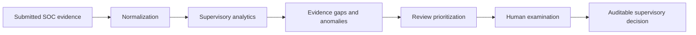
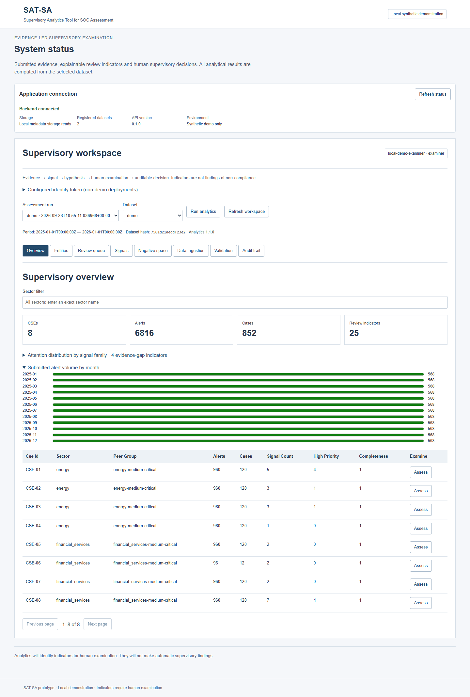
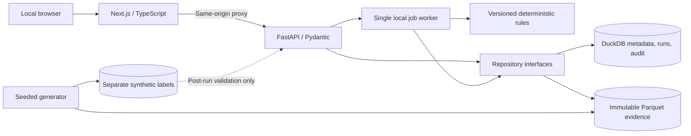

# SAT-SA · Supervisory Analytics Tool for SOC Assessment

**An evidence-led, local supervisory prototype for examining periodic SOC submissions.** SAT-SA helps an NCIIPC supervisor choose entities and source records for human examination. It is not a SIEM, an automated compliance decision maker, or an AI chatbot. The repository is hosted as [VISTA](https://github.com/nischala755/VISTA).

[Run the demo](#run-the-demo) · [Guided walkthrough](#guided-supervisory-walkthrough) · [Compare periods](#compare-two-assessment-periods) · [Bring a submission](#bring-a-structured-submission) · [How it works](#how-the-system-works) · [Render deployment](#render-cloud-deployment) · [Developer setup](#developer-setup) · [Verification](#verification-and-tested-results) · [Limits](#security-offline-operation-and-limits)

> **Status:** The full **prototype** workflow is implemented and tested. It is not accredited for restricted submissions or benchmarked for million-record operation. See the [current verification report](docs/completion-verification.md) for exact commands, results, deviations, and open limits. The [Phase 1 report](docs/phase-1-verification.md) is a historical foundation snapshot.

**Smart India Hackathon packet:** [49-second demo](docs/submission/demo-walkthrough.mp4) · [five-slide presentation](docs/submission/technical-presentation.pdf) · [two-page architecture](docs/submission/architecture-2p.pdf) · [sample examiner report](docs/submission/sample-supervisory-report.pdf) · [objective map and expert-validation gate](docs/submission/README.md) · [latest verification](docs/submission/verification.md). The earlier completion report remains a historical snapshot; use the submission verification for this revision.

**Cloudflare demo:** a [temporary HTTPS tunnel is verified](docs/cloudflare-verification.md). Follow the [Cloudflare deployment guide](docs/cloudflare-deployment.md) for the authenticated local setup and the remaining steps to attach a stable hostname under your Cloudflare account. The offline Compose path above remains the authoritative deployment for restricted environments.

<details>
<summary><strong>Choose a path</strong></summary>

| I want to… | Start here |
| --- | --- |
| Explore the synthetic demo | [Run the demo](#run-the-demo), then follow the [walkthrough](#guided-supervisory-walkthrough) |
| Import a structured SOC export | [Bring a structured submission](#bring-a-structured-submission) |
| Understand a signal or priority | [Analytical interpretation](#analytical-interpretation) and [methodology](docs/analytics-methodology.md) |
| Develop or test locally | [Developer setup](#developer-setup) and [verification](#verification-and-tested-results) |
| Prepare disconnected deployment | [Offline operation](#security-offline-operation-and-limits) and [deployment notes](docs/deployment.md) |
| Prepare a cloud-hosted synthetic demo | [Render cloud deployment](#render-cloud-deployment) |
| Inspect optional evidence drafts | [Qwen and Mistral](#optional-evidence-summary-drafting) |

This README uses GitHub-native links, tables, Mermaid diagrams, and expandable sections. Nothing in the guide loads a remote widget or needs JavaScript beyond GitHub's own renderer.

</details>

## What the product does



SAT-SA imports CSV/JSON evidence, preserves an immutable dataset version, calculates deterministic indicators across eight supervisory families, and links each indicator to source records. The examiner sees the observation, rule, thresholds, completeness, peer or within-period context, and a **hypothesis to investigate**. Only a human records an outcome. The analytical engine never reads the separate synthetic ground-truth labels and never calls an AI provider.

The **Period comparison** view compares two completed, non-overlapping assessment runs using 30-day alert and case rates. It marks absent entities, changed names or changed cohorts as unavailable. The **Report** view assembles the selected run's actual indicators, evidence references, limitations and human decisions; use **Print or save as PDF** or download the underlying JSON. Neither view creates a supervisory finding automatically.

## Compare two assessment periods

The default demo has one period. To create an earlier, immutable synthetic submission in the same Compose volume, stop the API writer, generate and register the 2024 evidence, then restart. This operation uses the same seeded generator with different assessment dates; it does not copy or fabricate analytics results.

```powershell
docker compose stop api
docker compose run --rm --no-deps api python scripts/generate_demo.py --seed 20260927 --assessment-year 2024 --output /var/lib/sat-sa/evidence/demo-2024 --labels-output /var/lib/sat-sa/ground_truth/demo-2024 --register /var/lib/sat-sa/metadata.duckdb
docker compose start --wait api
```

In the workspace, select `demo-2024` and **Run analytics**. Select `demo` and its completed run, open **Period comparison**, choose the 2024 run as the baseline, and select **Compare periods**. The two runs retain their own dataset hashes. Rates account for the 2024 leap year. The seeded scenarios recur across years, so this is a workflow demonstration, not evidence of an actual improvement or deterioration. The separately stored ground-truth labels are never exposed through normal evidence APIs.

Open **Report** for either run to print a supervisory handout. It contains at most 50 indicators, 10 sample references per indicator, and 20 suggested samples; the view states those limits and the normal signal/evidence APIs support complete drill-down.

The default demonstration contains eight pseudonymous CSEs across energy and financial-services cohorts, 12 months of 2025 evidence, 192 assets, 6,816 alerts, 852 cases, 3,322 investigation events, and 2,696 escalation records. Its 25 current entity-level review indicators are calculated from that data, not embedded as dashboard fixtures.

## Run the demo

Install Git and Docker with Compose. The first image build needs access to prepared base images and dependency packages; subsequent **runtime** operation can be disconnected.

```powershell
git clone https://github.com/nischala755/VISTA.git
cd VISTA
docker compose up --build --wait
docker compose ps
```

Open **http://127.0.0.1:3001**. Wait for **Backend connected** and **Local metadata storage ready**. A fresh volume starts with one registered `demo` dataset; imports add more. The first startup generates the demo and queues a real analytical run. Refresh the workspace if the run is still finishing.

| Local service | Compose URL | Native development URL |
| --- | --- | --- |
| Application | http://127.0.0.1:3001 | http://127.0.0.1:3000 |
| Backend health | http://127.0.0.1:8001/api/v1/health | http://127.0.0.1:8000/api/v1/health |
| OpenAPI JSON | http://127.0.0.1:8001/openapi.json | http://127.0.0.1:8000/openapi.json |
| Frontend status | http://127.0.0.1:3001/api/status | http://127.0.0.1:3000/api/status |

<details>
<summary><strong>Inspect, stop, and restart the containers</strong></summary>

```powershell
docker compose logs --tail 100 api web
docker compose stop
docker compose start --wait
```

The named `sat-sa_sat-sa-data` volume holds evidence, metadata, results, reviews, and audit events. `docker compose down` retains it; `down --volumes` deletes it. The API runs one writer process because the metadata store is DuckDB. Do not run a metadata-writing CLI against the same database while the API is active.

</details>

<details>
<summary><strong>See the tested screens</strong></summary>

The [loaded overview](docs/verification/completion-overview.png) shows real demo totals, monthly alert volumes, and entity assessment links. The [evidence drawer](docs/verification/completion-evidence.png) shows an observation, hypothesis, completeness basis, and paginated source references. The [actual backend outage screen](docs/verification/real-backend-outage.png) shows the visible failure and retry state. These are verification captures, not live status indicators.



</details>

## Guided supervisory walkthrough

Use the synthetic demo. The walkthrough follows the same context from dataset and run to source evidence and a human action.

1. **Establish context.** Confirm the green backend status, select the `demo` dataset and its completed assessment run. The run line shows its period, dataset hash, and analytics version. A new run keeps its own configuration snapshot and does not overwrite previous results.
2. **Scan the overview.** Compare CSE, alert, case, and review-indicator counts. Expand **Attention distribution** and **Submitted alert volume by month**. The exact-name sector filter can narrow imported sectors too.
3. **Examine an entity.** Select **Assess** on `CSE-01`. Read its peer and within-period context, then select **Inspect evidence** on **High-severity alerts closed unusually quickly**. The rule reports how many eligible alerts matched. Fast closure by itself does not establish poor investigation.
4. **Trace the evidence.** In the drawer, distinguish **observed evidence**, **inferred signal**, and **supervisory hypothesis**. Expand the calculation and thresholds. Page through references and choose **Open source** to inspect the underlying record. Source lookups are scoped to dataset, CSE, table, and record ID.
5. **Check missing evidence.** Open **Negative space**. Each indicator names an expected record or category, observed evidence, and an unavailable or gap condition. A missing export field is not proof that an operational action never occurred.
6. **Prioritize a sample.** Open **Review queue**. A record may support several indicators but appears once, with visible additive priority contributions. **Review evidence** opens the selected source and its related signal. Priority points are not compliance probabilities.
7. **Make the human decision.** In the evidence drawer, choose an outcome, enter a note, and select **Record human decision**. Open **Audit trail** to see the actor, timestamp, action, and object. A confirmed concern exists only after this human action.
8. **Interpret validation separately.** **Validation** compares the synthetic injected-label universe with selected records. It shows denominators and a random baseline; human-review outcomes are in a separate section. These numbers do not measure real-world effectiveness or examiner time saved.

<details>
<summary><strong>What each workspace view contains</strong></summary>

| View | Main question | What to inspect |
| --- | --- | --- |
| Overview | Where should I start? | Submitted volumes, indicators, sector and entity summaries |
| Entities / entity assessment | What happened at this CSE? | Cohort, peer/history context, unavailable analyses and signals |
| Review queue | Which source records merit examination? | Deduplicated sample, reasons and score contributions |
| Signals | Why was this indicator produced? | Family, severity, observed facts, calculation and evidence |
| Negative space | What expected evidence is absent? | Expectation source, observed evidence and sufficiency limits |
| Data ingestion | Is this export valid and usable? | Mapping, rejected rows, missingness and immutable publication |
| Validation | How did selection perform on synthetic labels? | Denominators, ranking yield and separate human outcomes |
| Audit trail | Who acted, when, and on what? | Persisted registrations, runs and supervisory decisions |

</details>

## Bring a structured submission

Use **Data ingestion** in the workspace. Give the dataset a new version ID, select CSV or JSON files, assign each to one of `cses`, `assets`, `alerts`, `cases`, `investigation_events`, or `escalations`, and enter optional **source-column → canonical-column** mappings as JSON. Supply CSE metadata alongside related evidence. Choose **Validate and preview** before **Import immutable dataset**; the import action is enabled only for a valid preview. The UI shows submitted/rejected counts, missingness, normalized records, job progress, and errors.

Select the published dataset and choose **Run analytics**. Jobs and completed runs persist across application restarts. Duplicate dataset registration fails rather than replacing a version. Invalid or reversed lifecycle timestamps fail validation; absent optional evidence remains representable. Non-null links to an alert, case, asset, or CSE must resolve within the same CSE. Raw source files and their hashes are retained separately from normalized Parquet evidence.

| Ingestion boundary | Current value |
| --- | --- |
| File types | CSV and JSON |
| Files per submission | 12 maximum |
| File content | 2 MB maximum per file |
| Combined rows | 10,000 maximum |
| Validation | All-or-nothing publication; invalid submissions do not become datasets |
| Analytics input | 100,000 records maximum in the current orchestrator |

The [data dictionary](docs/data-dictionary.md) describes canonical fields and units. Canonical Pydantic models are in `packages/analytics-contracts/sat_sa_contracts/models.py`; generated JSON schemas are in `data/schemas/`. A configured internal REST export adapter exists for administrator use, but is disabled by default. It accepts a fixed private-IP endpoint from deployment configuration, not a caller-supplied URL. Database exports use the same CSV/JSON contracts.

<details>
<summary><strong>Use the API directly for inspection</strong></summary>

These read-only examples use the running Compose deployment. Lists are paginated (`limit` 1–100 and nonnegative `offset`). Replace IDs with values returned by your own run.

```powershell
$base = 'http://127.0.0.1:8001/api/v1'
Invoke-RestMethod "$base/health"
Invoke-RestMethod "$base/datasets?limit=10&offset=0"
Invoke-RestMethod "$base/analytics/runs?limit=10&offset=0"
Invoke-RestMethod "$base/entities?limit=10&offset=0"
Invoke-RestMethod "$base/signals?cse_id=CSE-01&limit=10&offset=0"
Invoke-RestMethod "$base/review-queue?cse_id=CSE-01&limit=10&offset=0"
Invoke-RestMethod "$base/evidence?dataset_id=demo&cse_id=CSE-01&table=alerts&limit=10&offset=0"
```

`/api/v1/overview`, `/trends`, `/peer-analysis`, `/validation`, `/reviews`, and `/audit` provide further read paths. `/signals/{signal_id}` pages references; `/jobs/{job_id}` reports async progress. The browser uses a same-origin `/api/service/...` proxy to the local backend. OpenAPI JSON is available; CDN-backed API documentation pages are disabled for offline operation.

</details>

## How the system works



| Location | Responsibility |
| --- | --- |
| `apps/web/` | Next.js shell, assessment views, ingestion wizard, status proxy, browser tests |
| `apps/api/sat_sa_api/` | Typed FastAPI routes, identities, jobs, storage health |
| `analytics/sat_sa/ingestion/` | Parsing, mapping, validation, provenance and publication |
| `analytics/sat_sa/signals/`, `negative_space/`, `peer_analysis/` | Deterministic indicators, expectation gaps and comparable cohorts |
| `analytics/sat_sa/prioritization/`, `validation/` | Review sampling and post-run evaluation |
| `analytics/sat_sa/repositories/` | DuckDB metadata/audit and scoped Parquet reads |
| `analytics/sat_sa/synthetic/` | Seeded demo generation and idempotent bootstrap |
| `packages/analytics-contracts/`, `packages/shared-types/` | Canonical contracts and generated frontend types |
| `config/engine.json` | Active validated analytical thresholds |
| `data/sample/demo/`, `data/ground_truth/demo/` | Checked-in synthetic evidence and separately stored labels |
| `docker/`, `compose.yaml`, `compose.offline.yaml` | Local images and isolated-network verification |
| `docs/` | Architecture, methods, deployment and measured verification |

The source hierarchy is the [problem statement](docs/problem-statement.md), [approved architecture](docs/architecture.md), [engineering instructions](AGENTS.md), then the [completion plan](docs/superpowers/plans/2026-09-27-completion.md). The user-authorized optional Mistral exception is recorded in the architecture addendum. The default product remains fully functional without any model or cloud service.

### Analytical interpretation

The eight families cover detection, investigation, escalation, incident response, security operations, governance, operational discipline, and cyber resilience. Rules include fast closure, weak investigation evidence, absent expected escalation evidence, recurring activity, long-running cases, workload concentration, missing fields, closure bursts, monitoring/category gaps, low activity against matched peers, peer closure deviation, and a bounded metric-integrity combination. A signal presents an observable predicate and review hypothesis, **not** a finding of non-compliance.

Peers match sector, peer group, criticality, entity size, and assessment window, exclude the subject, and require a minimum cohort. Within-period history is a split of the submitted period, not a separate prior-period submission. Missing inventory suppresses coverage analysis. Confidence depends on the relevant sample and field completeness; it is not a calibrated probability. Review priority adds documented severity, corroboration, sufficiency, recurrence, and peer-deviation contributions. Novelty currently contributes zero because prior-run comparison is unavailable. Exact rules, defaults and limitations are in the [analytics methodology](docs/analytics-methodology.md).

## Render cloud deployment

The repository now includes a [Render Blueprint](render.yaml) for a **synthetic, token-gated prototype**: a private API with a persistent disk and a public Next.js frontend connected over Render's private network. This is an **opt-in paid cloud deployment**; it does not replace the verified local/offline mode. Render's current selected plans imply about **$32/month for compute plus disk and usage**, subject to its live pricing. The cloud services have **not yet been provisioned or verified**. Follow the [step-by-step Render guide](docs/render-deployment.md) for account setup, secret entry, first analytical run, and post-deployment persistence checks. Cloudflare Workers would need a different persistence architecture, so there is no equivalent one-click Cloudflare configuration for this codebase.

## Developer setup

<details open>
<summary><strong>Windows PowerShell: backend and frontend</strong></summary>

Use Python 3.12 and Node.js 24. Install dependencies while registries or a prepared cache are available:

```powershell
python -m venv .venv
.venv\Scripts\python -m pip install -r requirements.lock
.venv\Scripts\python -m pip install -e . --no-deps
npm --prefix apps/web ci --no-audit --no-fund
.venv\Scripts\python scripts/export_contracts.py --check
.venv\Scripts\python -m sat_sa.synthetic.bootstrap
```

Start the API in one terminal from the repository root:

```powershell
.venv\Scripts\python -m uvicorn sat_sa_api.main:create_app --factory --host 127.0.0.1 --port 8000 --workers 1
```

Start the frontend in a second terminal from the same root:

```powershell
npm --prefix apps/web run dev
```

Open http://127.0.0.1:3000. `runtime/` holds native evidence, ground truth, and `metadata.duckdb`. Bootstrap verifies and reuses an existing matching demo; it does not overwrite a conflicting version. Stop the API before running a CLI that writes this metadata store. To check a production frontend build, stop any running production frontend, then run `npm --prefix apps/web run build` followed by `npm --prefix apps/web start`.

</details>

<details>
<summary><strong>Linux/macOS native commands</strong></summary>

```bash
python3.12 -m venv .venv
.venv/bin/python -m pip install -r requirements.lock
.venv/bin/python -m pip install -e . --no-deps
npm --prefix apps/web ci --no-audit --no-fund
.venv/bin/python scripts/export_contracts.py --check
.venv/bin/python -m sat_sa.synthetic.bootstrap
.venv/bin/python -m uvicorn sat_sa_api.main:create_app --factory --host 127.0.0.1 --port 8000 --workers 1
```

In another terminal, run `npm --prefix apps/web run dev`. Linux container runtime was verified; these native host commands were recorded as setup guidance, not tested on every Linux/macOS distribution.

</details>

<details>
<summary><strong>Generate a deterministic copy of the demo</strong></summary>

```powershell
.venv\Scripts\python scripts/generate_demo.py --seed 20260927 --output artifacts/replica/demo --labels-output artifacts/replica-labels/demo
```

Destinations must be unused. The last directory name is the logical version ID, so keep `demo` on both copies when comparing full manifests. Identical seeds, version IDs and writer versions produce identical logical records and artifact hashes; different seeds produce different datasets. The generator keeps labels outside evidence, and normal evidence APIs do not expose them. To register a new version against an **inactive** native database, add `--register runtime/metadata.duckdb`; duplicate registration fails. See [dataset verification](docs/completion-verification.md).

</details>

## Verification and tested results

Run the local checks from the repository root after setup:

```powershell
.venv\Scripts\python -m pytest -q
.venv\Scripts\python scripts/export_contracts.py --check
npm --prefix apps/web test
npm --prefix apps/web run typecheck
npm --prefix apps/web run build
```

With the application running, `npm --prefix apps/web run test:e2e -- --workers=1` exercises the browser. It defaults to a prepared Microsoft Edge installation; set `PLAYWRIGHT_CHANNEL` for another already installed Playwright browser. Set `SAT_SA_WEB_URL` when testing a nondefault URL. The browser tests create a synthetic imported dataset and human review in the selected local runtime. For a full isolated-container check, run `.venv\Scripts\python scripts/verify_containers.py` against this project's synthetic Compose deployment; it temporarily stops/recreates services, tests denied egress and persistence, then restores normal networking.

| Verified gate (2026-09-28 completion report) | Result |
| --- | --- |
| Python regressions | 101 passed; one upstream deprecation warning |
| Frontend unit and browser tests | 5 + 5 passed |
| TypeScript and final Docker production build | Passed |
| Generated contract freshness | 26 artifacts matched |
| Same-seed records and hashes; different seed | Deterministic; different seed changes data |
| Real backend outage and retry | Visible in browser test |
| Docker startup, isolated core runtime and restart | Passed; external TCP probes blocked during isolation |
| Optional local Qwen generation | Succeeded on the tested host |
| Optional live Mistral generation | HTTP 429; successful call unverified |

The final synthetic run analysed 13,886 records and produced 25 indicators. Its post-run selection precision was 55.86%, recall 95.59%, false-positive rate 8.21%, Precision@20 100%, Recall@20 1.47%, and reference traceability 100%. These evaluate injected synthetic patterns, not actual SOC effectiveness. No measured examiner time-savings claim is made. See [validation methodology](docs/validation-methodology.md) for denominators and [completion verification](docs/completion-verification.md) for exact commands, exit codes, environment versions, and limitations.

Generated contracts are derived from the canonical models. After an intentional model change, run `scripts/export_contracts.py` without `--check`, review the generated TypeScript and JSON schemas, then run with `--check`. Hand edits to generated files fail freshness verification.

## Security, offline operation and limits

The default Compose deployment is a **local synthetic demo** bound to `127.0.0.1`. Demo identity is server-owned (`local-demo-examiner` by default). In non-demo mode, configure `SAT_SA_DEMO_MODE=false` and `SAT_SA_AUTH_TOKENS` as a JSON map from bearer token to `{ "actor": "name", "role": "reader|examiner|administrator" }`. Roles and actors come from the backend; a browser cannot supply them as authoritative fields. A reader cannot write. This is a prototype boundary, not SSO/MFA or security accreditation; use deployment-managed TLS, access controls and encrypted storage for any controlled deployment.

The core application needs no Internet, SaaS, cloud API, model download, remote font, CDN asset, or telemetry at runtime. Both final containers served the shell, eight bundled assets, API, analytics, evidence, and human review on an **internal-only** Docker network while external TCP probes failed. Standard Compose uses a local bridge so host ports work and **does not enforce egress blocking by itself**. Apply host/network policy for a permanently disconnected deployment. Initial image builds need dependencies or previously prepared images:

```powershell
# Connected preparation host
docker compose build
docker image save -o sat-sa-images.tar sat-sa-api:phase1 sat-sa-web:phase1

# Disconnected target with the archive and compose.yaml copied over
docker image load -i sat-sa-images.tar
docker compose up --pull never --no-build --wait
```

The image tags retain `phase1` for deployment compatibility; they contain the completed prototype code. The [deployment guide](docs/deployment.md) details storage, restarts and the network verification override.

| Limit or boundary | Consequence |
| --- | --- |
| One DuckDB writer / API worker | No multi-process metadata writes or distributed job queue |
| 100,000 analytical records maximum | No million-record readiness claim; streaming/SQL aggregation and benchmarks remain |
| 10,000 imported rows and 2 MB/file | Larger exports need a different ingest pipeline |
| Hashes and local audit | Changed files can be detected; audit is not signed or tamper-proof |
| Synthetic labels and metrics | No claim of calibrated performance on real SOC submissions |
| Peer matching and novelty | Asset-count/environment/volume comparison and prior-run novelty remain partial |
| Filesystem/database publication | A crash can leave unregistered files; it cannot silently overwrite an immutable version |

### Configuration reference

| Variable | Default / behavior | Scope |
| --- | --- | --- |
| `SAT_SA_STORAGE_ROOT` | `runtime`; Compose sets `/var/lib/sat-sa` | API and bootstrap storage |
| `SAT_SA_DEMO_SEED` | `20260927` | First demo generation; does not replace existing data |
| `SAT_SA_DEMO_MODE` | `true` | Local demo identity or configured bearer mode |
| `SAT_SA_DEMO_ROLE` | `examiner` | Server-owned demo permission |
| `SAT_SA_AUTH_TOKENS` | Empty JSON map | Configured server-owned actors/roles |
| `SAT_SA_INTERNAL_EXPORT_URL` | Unset/disabled | Fixed private-IP administrator adapter |
| `SAT_SA_API_URL` | `http://127.0.0.1:8000`; Compose sets `http://api:8000` | Frontend server-side proxy |
| `NEXT_TELEMETRY_DISABLED` | Set by launch scripts/Compose | Frontend telemetry |
| `PLAYWRIGHT_CHANNEL`, `SAT_SA_WEB_URL` | `msedge`, local URL | Browser tests only |
| `MISTRAL_API_KEY`, `SAT_SA_MISTRAL_MODEL` | Unset, `mistral-small-latest` | Optional CLI only |

Active analytical thresholds are in validated `config/engine.json`; `config/defaults.json` remains a foundation config. The backend does not automatically load `.env` files. Compose only passes variables named in its configuration. Keep credentials outside tracked files.

## Optional evidence-summary drafting

AI drafting is an **optional CLI**, isolated from analytics, scoring, review decisions and the web application. It selects at most ten records from one dataset and CSE, verifies the manifest, includes original source references, and never includes ground-truth labels. Treat every sentence as an untrusted draft to check against those records. No provider is needed for core operation; there is no automatic cloud fallback.

<details>
<summary><strong>Local Qwen through Ollama</strong></summary>

The tested host used Ollama 0.34.4 and a prepared `qwen3.5:2b` model. Obtain the model **before** disconnecting; no runtime pull occurs.

```powershell
ollama list
# Connected preparation only, if absent: ollama pull qwen3.5:2b
$env:OLLAMA_NO_CLOUD = '1'
$env:OLLAMA_HOST = '127.0.0.1:11434'
ollama serve
```

In a separate terminal from the repository root:

```powershell
.venv\Scripts\python scripts/summarize_evidence.py --cse CSE-01 --table alerts --limit 3
```

The adapter uses loopback, rejects redirects/proxies, and bounds records, output and time. Actual local generation succeeded. **Qwen inference under enforced host egress denial was not tested**; the core Docker offline verification does not invoke Qwen.

</details>

<details>
<summary><strong>Optional Mistral with explicit cloud consent</strong></summary>

This user-authorized exception sends **selected evidence** to Mistral only when both the provider and `--allow-cloud` are specified. Supply a valid key in the invoking shell without writing it into repository files or command history:

```powershell
$credential = Get-Credential -UserName 'mistral' -Message 'Enter API key in password field'
$env:MISTRAL_API_KEY = $credential.GetNetworkCredential().Password
$env:SAT_SA_MISTRAL_MODEL = 'mistral-small-latest'
.venv\Scripts\python scripts/summarize_evidence.py --cse CSE-01 --limit 1 --provider mistral --allow-cloud
Remove-Item Env:MISTRAL_API_KEY
```

Use synthetic or explicitly approved evidence only. The supplied key was not committed. A live verification request returned **HTTP 429**; successful live generation remains unverified. The Mistral adapter has mocked-provider tests, but those do not establish provider availability.

</details>

## Troubleshooting

<details>
<summary><strong>The page loads, but the backend is unavailable</strong></summary>

Open the backend health URL in the table above and inspect `docker compose logs --tail 100 api web`. For native development, start the API before the frontend. Inside Compose, the web container reaches `http://api:8000`, not its own `127.0.0.1`. The UI displays a failure and retry state; a rendered shell alone does not establish connectivity.

</details>

<details>
<summary><strong>There is no completed run yet</strong></summary>

First startup queues real demo analytics in the background. Wait for the job to finish or use **Refresh workspace**. Select the registered dataset and choose **Run analytics** if needed. Inspect `/api/v1/analytics/runs` and service logs. A failed job stays visible; no fake indicators are inserted.

</details>

<details>
<summary><strong>Import fails or a dataset ID already exists</strong></summary>

Use **Validate and preview** to read field and relationship errors. Confirm timestamps, source-to-canonical mappings, CSE metadata and cross-record IDs. Use a new version ID for another import; an existing immutable version cannot be overwritten. Missing optional evidence can be null, but an asserted non-null reference must resolve within its CSE.

</details>

<details>
<summary><strong>DuckDB reports a lock</strong></summary>

Stop the API before using a metadata-writing CLI against the same `runtime/metadata.duckdb` or Compose volume. Restart with one API worker. DuckDB is not a multi-process server; repository interfaces preserve a later migration path.

</details>

<details>
<summary><strong>Docker isolation shows healthy containers but no host ports</strong></summary>

The internal-only verification network prevented host port publication on the tested Docker Desktop version. The verifier checks frontend, bundled assets and API **inside** that network and restores normal Compose afterward. Use normal Compose for localhost browsing and a deployment network/firewall for permanent egress denial.

</details>

<details>
<summary><strong>Frontend build reports EBUSY, or browser tests cannot launch</strong></summary>

On Windows, stop the running production frontend before rebuilding its standalone output, then start it again. Browser tests default to installed Microsoft Edge. Prepare the chosen Playwright browser before a disconnected test run and set `PLAYWRIGHT_CHANNEL` if using another browser.

</details>

## Documentation index

| Document | Use it for |
| --- | --- |
| [Problem statement](docs/problem-statement.md) | Authoritative product objectives and acceptance criteria |
| [Architecture](docs/architecture.md) | Approved system boundaries and documented exception |
| [Completion plan](docs/superpowers/plans/2026-09-27-completion.md) | Implemented task sequence |
| [Completion verification](docs/completion-verification.md) | Exact commands, versions, test counts and remaining gaps |
| [Phase 1 verification](docs/phase-1-verification.md) | Historical foundation verification only |
| [Data dictionary](docs/data-dictionary.md) | Canonical fields, units, relationships and missingness |
| [Analytics methodology](docs/analytics-methodology.md) | Predicates, expectations, peers, confidence and priority |
| [Validation methodology](docs/validation-methodology.md) | Label universe, denominators and evaluation limits |
| [Deployment](docs/deployment.md) | Local volumes, air-gap preparation, security and recovery boundaries |
| [Render deployment](docs/render-deployment.md) | Paid cloud Blueprint, token setup and live verification steps |
| [Optional summary design](docs/local-qwen-design.md) | AI drafting scope and safeguards |
| [Engineering instructions](AGENTS.md) | Repository agent guidance |

This repository has no software license. Public visibility alone does not grant reuse rights.
