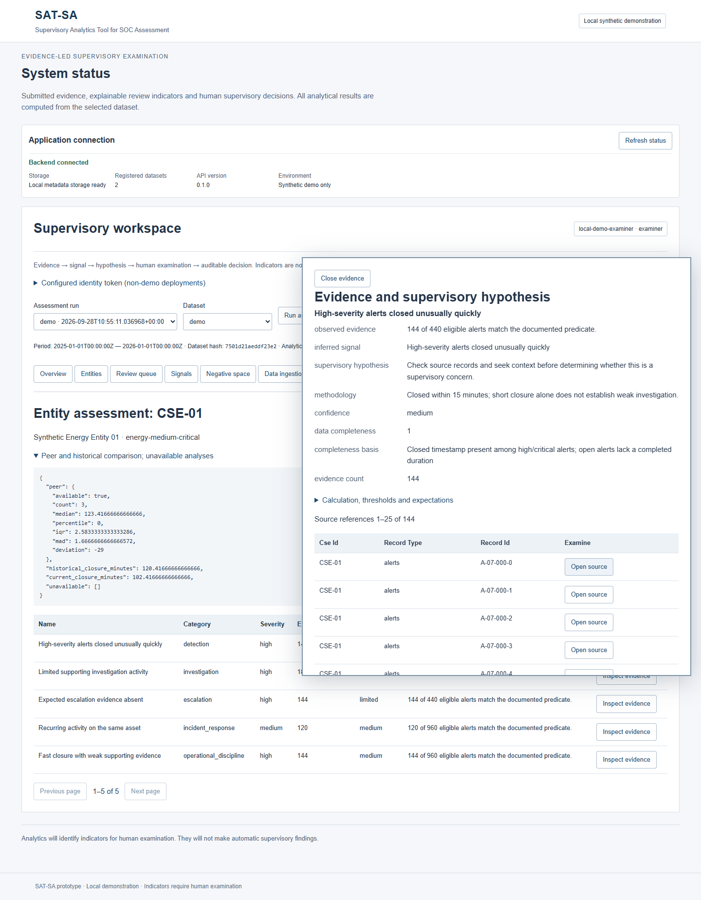

# SAT-SA completion verification — 2026-09-28

## Outcome and scope

The authorized **supervisory prototype workflow** is implemented: submitted evidence → normalization → deterministic supervisory analytics → evidence gaps/anomalies → review prioritization → human examination → persisted, auditable decision. The UI uses stored evidence and run results, not hard-coded findings. All eight rule families, peer/history context, CSV/JSON ingestion, review queue, validation, and audit have working paths. This is a tested prototype, **not** an accredited or million-record production system. The separate [Phase 1 report](phase-1-verification.md) remains the historical Phase 1 record.

These images were captured from the running Compose deployment on 2026-09-28 after loading actual demo analytics version 1.1.0. The second shows an evidence-derived signal, its hypothesis, completeness basis, and paginated source references.

## Environment and exact checks

Windows/PowerShell, Python 3.12.10, Node 24.18.0, npm 11.16.0, Docker 29.6.1, Compose v5.1.4, Git 2.54.0.windows.1. The commands below ran from the repository root. `scripts/Invoke-Check.ps1` records command, exit code and full output in ignored `artifacts/verification/commands.jsonl` and timestamped logs. The image/build and isolated-container checks were rerun after the final application commit. Test counts are from the exact logs shown.

| Exact command | Exit | Result and local log |
| --- | ---: | --- |
| `.venv\Scripts\python -m pytest -q` | 0 | 101 passed, one upstream Starlette/httpx deprecation warning; `20260927T132425736.log` |
| `.venv\Scripts\python scripts/export_contracts.py --check` | 0 | All 26 generated artifacts fresh; `20260927T132039445.log` |
| `npm --prefix apps/web test` | 0 | 5 Vitest tests passed; `20260927T132042661.log` |
| `npm --prefix apps/web run typecheck` | 0 | TypeScript clean; `20260927T132146027.log` |
| `npm --prefix apps/web run test:e2e -- --workers=1` | 0 | 5 Playwright tests passed against running Compose: local-only resources and health, real outage/retry, evidence→review→audit, queue source/pagination, and CSV/JSON wizard/import; `20260927T132832627.log` |
| `.venv\Scripts\python scripts/generate_demo.py --seed 20260927 --output artifacts/completion-replica/demo --labels-output artifacts/completion-replica-labels/demo` | 0 | Separate deterministic replica generated; `20260927T132632079.log` |
| `.venv\Scripts\python scripts/verify_phase1.py --api-url http://127.0.0.1:8010 --web-url http://127.0.0.1:3010 --replica artifacts/completion-replica/demo --replica-labels artifacts/completion-replica-labels/demo` | 0 | Seven evidence artifacts and one separate label artifact match original hashes; native frontend/backend connectivity and storage passed; `20260927T132635665.log` |
| `docker compose up --build --wait` | 0 | Final API/web production images built and healthy; `20260928T105324492.log` |
| `.venv\Scripts\python scripts/verify_containers.py` | 0 | Final isolated-network, blocked-egress, local frontend/assets/API, analytics, evidence trace, human review, and restart persistence passed; `20260928T105350795.log` |
| `node artifacts/capture-completion.mjs` | 0 | Loaded UI screenshots captured and visually inspected; script and original images are ignored local verification artifacts |

One preliminary container rerun on 2026-09-28 exited 1 because Docker Desktop's daemon had stopped overnight (`20260928T105228671.log`). Docker Desktop was restarted, Compose rebuilt, and the full check then exited 0. This environmental failure is retained in the logs; it is not represented as an application pass.

### Offline and persistence evidence

The final verifier ran both containers on an **internal-only** Docker network. External probes to `1.1.1.1` and `8.8.8.8` failed for each container. Inside that network, the frontend shell and eight bundled assets loaded, the web-to-API request passed, a real analytics run completed, an evidence reference resolved, and a human review was recorded. It then restored normal Compose and compared the immutable demo dataset, runs, reviews and audit across restart. Eleven audit events persisted; the demo manifest hash was `7501d21aeddf23e29bbb6dd3971ac46798db3274b8863797aa4d502f527f50b8`. The browser suite also rejected nonlocal resource requests. Thus the **core** runtime worked without Internet access. Standard Compose networking does not itself block egress; isolated deployment must provide that policy. Building images initially needs prepared base images/dependencies or network access.

The final health endpoint reported `status: ok`, `storage_ready: true`, and two registered datasets after the browser import. The health check reflects the repository and storage state. Frontend outage was tested by actually stopping the backend and observing a visible failure/retry state. Dataset registration and process restart tests cover immutability, duplicate rejection and durable metadata/audit. Unit/integration tests cover invalid/reversed lifecycle timestamps, representable missing evidence, entity-scoped references, label separation and different-seed changes. Identical seed/version generated byte-identical evidence and label hashes in the replica check.

### Analytical validation

The final synthetic demo run used analytics `1.1.0`, configuration hash `cc04888b40b3ea28cdf1df43684e095a288792cf83e382538ac9930fa68ddac6`, 13,886 analytical records and 25 entity-level indicators in 1.38 seconds on this host. Separate post-run labels give 1,361 labelled positive records, 2,329 selected records, 1,301 true positives and 1,028 false positives: precision **55.86%**, recall **95.59%**, false-positive rate **8.21%**, Precision@20 **100%**, Recall@20 **1.47%**, average precision **88.21%**, seeded random Precision@20 **10%**, and reference traceability **100%**. These are synthetic injected-pattern measures, not measured real SOC performance. No measured human time savings exist. Ground truth is stored outside analytical evidence and has no normal evidence API.

The independent code review found six material correctness issues: capped persisted history/recovery, escalation denominators, malformed CSV response handling, selected review-queue source/pagination, assessment-period peer matching, and rule-specific completeness. Each was reproduced with a failing regression then fixed; the 101-test suite and five browser tests include the fixes. A further 30-entity regression fixed overview totals that had depended on the display page. Exact-name sector filtering replaced a fixed demo-only sector list.

## Optional assistance

Local Qwen (`qwen3.5:2b` through Ollama 0.34.4) produced a bounded evidence-summary draft from synthetic records. The optional Mistral adapter is tested with mocked provider responses, requires both `--provider mistral --allow-cloud` and an environment credential, and is never part of core analytics. A live Mistral request returned HTTP **429**, so successful live Mistral generation is **unverified**. The credential was not committed or written to this report. Qwen inference under an egress-denied host was **not** tested; the isolated Docker verification covers the core application, which does not invoke either model. Drafts require human source checking and cannot create a signal, score or decision.

## Architecture decisions and deviations

- Retained the approved Next.js/TypeScript frontend, FastAPI/Pydantic backend, versioned Python analytics, immutable Parquet evidence, DuckDB metadata/audit and single writer. Shared contracts are generated reproducibly and drift fails `--check`.
- **User-authorized exception:** optional Mistral sends selected evidence to an external service only with explicit CLI cloud consent. The default application remains local, offline, and AI-independent; this differs from the original blanket external-API prohibition and is documented in the architecture addendum.
- The approved architecture describes PostgreSQL as a possible future metadata path. The delivered prototype uses the approved single-owner DuckDB option; PostgreSQL and distributed writers are not implemented.
- Docker Desktop did not expose host ports from an internal-only network on this environment. Normal Compose uses a bridge for local access; the separate offline override enforces blocked egress during verification. Deployment must supply an outbound firewall/isolation policy if it requires denied egress continuously.

## Files and remaining limits

Created/modified implementation groups: `analytics/sat_sa/{assistance,config,ingestion,negative_space,peer_analysis,prioritization,repositories,risk,signals,validation}`, `apps/api/sat_sa_api/{main,routes,workflow}.py`, `apps/web/app/{api,components,globals.css,page.tsx}`, `apps/web/lib/workbench.ts`, `config/engine.json`, generated schemas/shared types, CLI scripts, and Python/browser tests. Documentation updated: README, architecture, analytics/validation methodology, data dictionary, deployment, Qwen design, completion plan/ledger, this report and the two verified screenshots. The exact path inventory is available from `git diff --name-status 221c4b2..HEAD` after delivery.

Remaining acceptance gaps for production use: analytics materializes up to 100,000 records; uploads are bounded to 10,000 rows, 2 MB/file and 12 files. Millions-of-record throughput, long-term temporal benchmarking across multiple submissions, calibrated real-world precision, SSO/MFA, signed/tamper-evident audit, application-managed encryption, distributed jobs, and multi-worker metadata writes are not implemented or claimed. Some peer comparability fields (asset count/environment/volume) and sophisticated novelty scoring remain partial prototype rules. Synthetic truth is not operational ground truth. Standard Compose is accessible only on loopback but does not independently prevent container egress. Optional Mistral success and isolated Qwen inference remain unverified as above.
